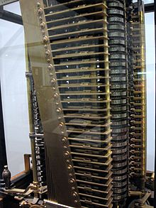

= Fondamentaux en programmation - Python

:revealjs_theme: white
:imagesdir: images
:revealjs_center: true
:customcss: custom.css
:revealjs_width: 1500
:source-highlighter: rouge
:author: Nicolas ANTRAYGUES - AIGYRE Consult

== Un peu d'histoire ?

=== Premier programme informatique

De quand date le premier programme informatique ?

[%step]

* 1843
* Note G
* Ada Lovelace
* Permet le calcul le nombre de Bernoulli

[.columns]
[%notitle]
=== Ada lovelace

[.column]
--
image::noteg.jpg[Note G,role=center,width=400px]
--

[.column]
--
image::ada.jpg[Ada,role=center,width=400px]
--

=== Machine analytique

* Créer par Charles Babbage en 1834
* Donne les bases conceptuelles des ordinateurs modernes

=== Alan Turing

* Pionier de l'informatique et de la crytanalyse

* Decryptage d'Enigma

* En 1950 conçoit le Test de Turing

* Participe au développement de la première génération d'ordinateur

[%notitle]
=== Alan Turing
[.column]
--
image::turing.jpg[Turing, width=400px]
--

=== L'objection de Lady Lovelace par Alan Turing

> La machine analytique n'a nullement la prétention de créer quelque chose par elle-même. Elle peut exécuter tout ce que nous saurons lui ordonner d'exécuter […] Son rôle est de nous aider à effectuer ce que nous savons déjà dominer.

== C'est quoi un programme informatique ?

[%step]

* Un programme informatique est une série d'opérations logiques et d'algorithmes qui indiquent à l'ordinateur comment traiter les données d'entrée pour produire les résultats souhaités en sortie.

* Premier programme stocké dans des cartes perforées de 80 colonnes

image::carte.jpg[Carte, height=100px]

* https://fr.wikipedia.org/wiki/Carte_perfor%C3%A9e

=== C'est quoi qu'un algorithme ? 

> Un algorithme est une suite finie et non ambiguë d'instructions et d’opérations permettant de résoudre un problème.

=== Qu'est qu'un langage de programation ? 

Langage informatique qui implémente des algorithmes exécuté dans un programe informatique

Un langage de programmation est composé de règles syntaxiques spécifiques compréhensibles par les ordinateurs.

=== Principe de programmation

* SOLID
* Kiss
* Dry

* Zen of Python

[source, python]
----
import this
----

=== Interprété ou compilé ?

=== Compilé

Traduit en amont les instruction d'un programe en langage machine pour qu'il soit éxécuté.

* Assurée par un compilateur

Langage compilé :

* C (gcc)
* C++ (g++)
* Golang (go)

=== Interprété

Traduit les instruction au moment de l'éxecution les instruction en langage machine

* La traduction est assuré par un intérpreteur

* Moins performant qu'un langage compilé

Langage interprété :

* Ruby
* Perl
* Lua

== Pourquoi Python, c'est cool ?

image::python.png[Python, width=100px, float=right]

* Langage interprété
* Haut niveau
* Syntaxe simple et comprénsible

=== A quoi resemble un programme Python

=== Version

* Version de Python : 3.12 (2 Octobre 2023)

* Gros changement entre Python 2 et Python 3

* Définit dans la PEP 3100 https://peps.python.org/pep-3100/

[%notitle]
[.columns]
=== Version

[.column]
--
* Python 2 :
[source, python]
----
print "Coucou"
----
--

[.column]
--
* Python 3 :
[source, python]
----
print("Coucou")
----
--

=== Cas d'utilisation

== Notre premier programme !

=== Hello world

. Ouvrir un fichier `helloworld.py`

. Ecrire la ligne suivante

[source, python]
----
print("Hello world")
----

=== Executer notre programme

Avec une console :

[source, bash]
----
python3 helloworld.py
----

=== Jouer avec l'interpréteur

[source, ]
----
$ python3
Python 3.11.6 (main, Nov 14 2023, 09:36:21) [GCC 13.2.1 20230801] on linux
Type "help", "copyright", "credits" or "license" for more information.
>>> print("Hello world")
Hello world
----

* Tester le fonctionne et le comportement d'instruction

== C'est quoi une variable ?

* Zone mémoire où l'on stocke une donnée

* Une variable porte un nom (étiquette) qui permet d'y accéder

* Une zone mémoire à une adresse

=== C'est quoi une variable ?

[source, python]
----
ma_variable = 42
----

[%step]

* Le nom de ma variable ? 
* La valeur ?

=== La vie d'une varible

* Réservation de la mémoire
* Declaration
* Instantiation
* Affectation
* Suppression en mémoire

=== La vie d'une varible

* Python fait la déclaration, l'instatiation et l'affectation au même moment

* La gestion de la mémoire est automatique

[.columns]
=== C'est quand même bien Python

[.column]
--
En C :

[source, c]
----
int *a;

a = new int;
*a = 42;

delete a;
----
--

[.column]
--

En Python :

[source, python]
----
ma_variable = 42
----
--

=== Type de données (Primitif)

* Entier : `int`
* Nombre décimaux : `float`
* Booléan (True/False) `bool`
* Chaine de caractère : `str`
* Binaire : `bytes`

=== Typage dynamique

L'interpréteur Python reconnait lui même les types

[source, python]
----
>>> ma_variable = 42
>>> type(ma_variable)
<class 'int'>
----

[source, python]
----
>>> ma_variable = "Toto"
>>> type(ma_variable)
<class 'str'>
----

=== Constante

* Une constante est une variable dont sa valeur ne sera pas changer au cours de l'éxécution

* Par convention, écrit en majuscule

[source, python]
----
DEBUT_MAJUSCULE = 65
DEBUT_MINUSCULE = 97
----

* https://docs.python.org/fr/3/library/constants.html

=== Conversion de type

* Aussi appellé `cast`

[source, python]
----
>>> int("1")
1
>>> str(10)
"10"
----

[source, python]
----
PREFIX_LOG_ERROR = "[ERROR]"

print(PREFIX_LOG_ERROR + " une erreur est survenue")
----

=== Comment nommer ma variable ? 

> Il y a seulement 2 problèmes compliqués en informatique : nommer les choses, et l'invalidation de cache. ,Phil Karlton,

* Camel case : maVariable
* Snake case : ma_variable

* https://realpython.com/python-pep8/
* https://peps.python.org/pep-0008/

=== Rammasse miette

Programme qui va liberer les zonnes mémoires qui ne sont plus référencé par un programme

En anglais :

* Garbage collector / GC

== Opérateur et expression

=== Arithmetique

* Addition : `+`
* Soustraction : `-`
* Division : `/`
* Division entière : `//`
* Multiplication : `*`
* Exposant : `**`

* Modulo : `%` (Renvoie le reste de la division)

=== Comparaison

Renvoie `True` si la condition est rempli sinon `False`

* Inférieur à : `<`
* Supérieur à : `>`
* Inférieur ou égale : `<= `
* Supérieur ou égale : `>=`

[source, python]
----
>>> 5 < 10
True
>>> 15 < 10
False
>>> 15 > 10
True
----

=== Comparaison d'instance

* Opérateur `is`

[source, python]
----
>>> True is True
True
>>> True is False
False
----

=== Logique

Permet de comparer deux conditions

* `and`
* `or`

[source, python]
----
>>> True and False
False
>>> False and False
False
>>> True or False
True
>>> False or False
False
----

=== Affectation

* Affectation : =
* Opérande et affectation : += -= *= /=

[source, python]
----
>>> ma_varaible = 42
>>> ma_varaible
42
>>> ma_variable += 8
>>> ma_variable
50
>>> ma_variable -= 8
>>> ma_variable
42
----

== Fonctions natives

* https://docs.python.org/fr/3/library/functions.html

== Chaine de caractère et liste

=== Liste

* Déclarer en mettant les éléments entre `[]`
* Généralement utilisées pour stocker des collections d'éléments homogènes.
* Mutables
* Contacténable

[source, python]
----
>>> ma_liste  = [1,2,3]
>>> ma_liste[1]
2
>>> ma_liste[0] = 10
>>> ma_liste
[10,2,3]
>>> ma_liste.append(4)
>>> ma_liste
[10,2,3,4]
>>> ma_liste + [5,6,7]
[10,2,3,4, 5, 6, 7]
----

=== Liste

* L'opérateur `in` permet de vérifier l'existance d'un élément
* Une liste peut être vide

[source, python]
----
>>> ma_liste  = [1,2,3]
>>> 3 in ma_liste
True
>>> "Toto" in ma_liste
False
>>> ma_liste = []
----

=== Compréhension de liste

* Syntaxe concise pour créer des listes

[source, python]
----
>>> [i for i in range(10)]
[0, 1, 2, 3, 4, 5, 6, 7, 8, 9]
>>> [i for i in range(10) if i % 2]
[1, 3, 5, 7, 9]
>>> [i for i in range(10) if i % 2]
----

* https://docs.python.org/fr/3/library/stdtypes.html#list

=== Chaine de caractère

* Type de données
* Séquence de caractères 
* Délimitée par des guillemets (quote) simples  `'` ou doubles `"`
* Itérable
* Immutable

[source, python]
----
>>> ma_chaine = "Je suis une chaine de caractère"
>>> ma_chaine[0:2]
"Je"
>>> ma_chaine[-9:]
"caractère"
----

=== Chaine de caractère

* Utiliser '\' pour échaper des caractères spéciaux
* Peuvent être concaténées avec l'opérateur `+`
* Peuvent être comparé

[source, python]
----
>>> ma_chaine = "Je suis une \"chaine\" de caractère"
>>> ma_chaine_2 = "Je suis une \"chaine\"" + "de caractère"
>>> ma_chaine == ma_chaine_2
True
----

=== Formatage

* f-strings

[source, python]
----
ma_chaine = "La valeur est %s" % (valeur)
ma_chaine = f"La valeur est {valeur}"
ma_chaine = "La valeur est {valeur}".format(valeur=valeur)
ma_chaine = "La valeur est {valeur}".format(valeur="")
----

=== Methode utile

[source, python]
----
>>> ma_chaine = "    Je suis une / chaine de caractère      "
>>> ma_chaine.upper()
'    JE SUIS UNE / CHAINE DE CARACTÈRE      '
>>> ma_chaine.lower()
'    je suis une / chaine de caractère      '
>>> ma_chaine.strip()
'Je suis une / chaine de caractère'
>>> ma_chaine.split("/")
['    Je suis une ', ' chaine de caractère      ']
----

* https://docs.python.org/fr/3/library/stdtypes.html#str

== Structure de contrôle

2 types :

* Strucutre conditionnelles
* Boucles

=== Structures conditionnelles

Les structures conditionnelles permettent d'exécuter des blocs de code en fonction de certaines conditions.

=== if

* `if` : Exécution conditionnelle

[source,python]
----
note = 75
if note >= 60:
    print("Félicitations ! Vous avez réussi.")
----

=== else

* `else` : Sinon 

[source,python]
----
note = 45
if note >= 60:
    print("Félicitations ! Vous avez réussi.")
else:
    print("Dommage, vous n'avez pas réussi.")
----

=== elif

* `elif` : Plusieurs possibilité

[source,python]
----
note = 75
if note >= 90:
    print("Excellent !")
elif 70 <= note < 90:
    print("Bien fait !")
else:
    print("Peut mieux faire.")
----

=== Boucle

Les boucles permettent de répeter des blocs de code selon une condition

=== Boucle for

* La boucle `for` permet d'itérer sur une séquence

* Utilisation avec la `range()`

[source,python]
----
for i in range(5):
    print(i)
----

* Itération sur une séquence

[source,python]
----
for lettre in "MaChaineDeCaratère":
    print(lettre)
----

=== Boucle while

La boucle `while` permet d'exécuter un bloc de code tant qu'une condition est vraie.

=== Exécution tant que la condition est vraie

[source,python]
----
compteur = 0
while compteur < 5:
    print(compteur)
    compteur += 1
----

=== Contrôle des boucles

* `break` : Quitte la boucle
* `continue` : Passe à l'itération suivante

[source,python]
----
compteur = 0
while compteur < 10:
    if compteur == 5:
        break  # Quitte la boucle
    if compteur % 2 == 0:
        compteur += 1
        continue  # Passe à l'itération suivante sans exécuter le reste du bloc
    print(compteur)
    compteur += 1
----

== A vos claviers

=== TP 0

NOTE: 30 min

* Réécrire le code https://cours.aigyre.fr/codes/Filtrage.py

== Fonction

* Une fonction est une séquence d'instructions
* Accompli une tâche spécifique et réutilisable.
* Elle peut recevoir des paramètres en entrée
* Effectuer des opérations en utilisant ces paramètres
* Éventuellement retourner un résultat.

* Facilitent la modularité et la réutilisation du code en le divisant en morceaux logiques et autonomes.

=== Synatxe

[source, python]
----
def ma_fonction():
  print("Ceci est une fonction")

def ma_fonction_avec_arguments(arg1: int, arg2: int):
  print("Ceci est une fonction avec des arguments : ", arg1, arg2)

def ma_fonction_avec_arguments(arg1: int, arg2: int = None):
  print("Ceci est une fonction avec des arguments : ", arg1, arg2)

def ma_fonction_qui_retourne_une_valeur() -> str:
  return "Je suis le retour d'une fonction"
----

=== Appeller une fonction

[source, python]
----
>>> ma_fonction()
Ceci est une fonction
>>> ma_fonction_avec_arguments(2, 3) # Arguments positionnels
Ceci est une fonction avec des arguments : 2 3
>>> ma_fonction_avec_arguments(arg2=1, arg1=8) # Argument par mot-clé
Ceci est une fonction avec des arguments : 8 1
>>> ma_fonction_qui_retourne_une_valeur()
"Je suis le retour d'une fonction"
----

=== Portée des variables

* Les variables déclarées à l'intérieur d'une fonction ont une portée locale à cette fonction

[source, python]
----
>>> variable = 56
>>> def ma_fonction():
...   variable = 10
...   print(variable)
...
>>> ma_fonction()
10
----

=== Avantages des fonctions

* Modularité
* Réutilisation du Code
* Facilité de Maintenance

=== Module

* Fichier qui contient du code pouvant être utilisé dans d'autre programme
* Structure et organise le code de manière modulaire
* Python posséde une bibliothéque standard de modules qui étend ces possibilités.

[source, python]
----
import time # Importer toute la librairie

print(time.time())

from time import time # Import de la fonction time()

print(time())
----

https://docs.python.org/fr/3/library/index.html

== Les fichiers

=== Ouvrir un fichier

`open(filename: str, mode: str)` : Prend le chemin du fichier et le mode d'ouverture en paramètres.

Mode d'ouverture::
* "r" : Lecture (par défaut).
* "w" : Écriture 
* "a" : Ajout 
* "b" : Binaire

[source, python]
----
# Ouvrir un fichier en mode lecture
fichier_message_lecture = open("message.txt", "r")

# Ouvrir un fichier en mode écriture
fichier_message_ecriture = open("message.txt", "w")

# Ouvrir un fichier en mode ajout
fichier_message_ajout = open("message.txt", "a")
----

=== Lire un fichier

[source, python]
----
# Lecture de tout le contenu
contenu = fichier_message_lecture.read()

# Lecture d'une ligne
ligne = fichier_message_lecture.readline()

# Lecture de toutes les lignes dans une liste
lignes = fichier_message_lecture.readlines()

for ligne in fichier_message_lecture:
  print(ligne)
----

=== Ecrire dans un fichier

[source, python]
----
# Ecriture dans le fichier
fichier_message_ecriture.write("Hello world!")
----

=== Fermer le fichier

[source, python]
----
fichier_message_lecture.close()
fichier_message_ecriture.close()
----

=== Avec un **context manager** :

* Ferme le fichier à la fin du bloc
* Bonne pratique

[source, python]
----
with open("fichier", "w") as mon_fichier: # Le fichier est ouvert
  mon_fichier.write("Contenu de mon fichier")
# Le fichier est fermé
----

=== Doc

https://docs.python.org/fr/3.6/library/functions.html#open

== Types de données complexes

=== Collection

* Sructure de données 
* Stocke et organise plusieurs éléments sous une seule variable

=== Dictionnaire (dict)

* Collection d'éléments stocké sous forme de clé/valeur
* Chaque élément d'un dictionnaire a une clé et une valeur correspondante.

* Mutable
* Chaque clé dans un dictionnaire doit être unique

[source, python]
----
>>> clefs_probable = {18: 10, 10: 14, 2: 2}
>>> clefs_probable[18]
10

----

=== tuples

* Séquences immuables d'éléments.
* Contient différents types de données.
* Indexés

[source,python]
----
>>> a = (1, 2)
>>> a
(1, 2)
>>> a[0]
>>> a[0] = 5
Traceback (most recent call last):
  File "<stdin>", line 1, in <module>
TypeError: 'tuple' object does not support item assignment
----

=== Ensembles (set)

* Collections non ordonnées d'éléments uniques.
* Accepte des opérations comme l'union, l'intersection et la différence.

[source, python]
----
>>> mon_ensemble_1 = {1, 2, 3, 4, 5, 6}
>>> mon_ensemble_2 = {6, 7, 8, 9, 10}
>>> mon_ensemble_2.add(11)

>>> mon_ensemble_1 | mon_ensemble_2
{1, 2, 3, 4, 5, 6, 7, 8, 9, 10, 11}
>>> mon_ensemble_1 & mon_ensemble_2
{6}
----

=== TP Bonus

. Télécharger le code : https://cours.aigyre.fr/codes/TP_Bonus.py
. Optimiser la fonction pour ne pas lancer l'assertion
** La fonction doit retourné une liste d'entiers uniques

=== TP Bonus corrigé

[source, python]
----
def generer_list_random(n):
  return list({ random.randint(1,n): None for i in range(n) }.keys())
----

== Gestion d'erreur et exeception

* https://docs.python.org/fr/3/tutorial/errors.html

=== try .. except

* Le bloc try contient le code susceptible de provoquer une exception.
* Le bloc except spécifie comment le programme doit réagir lorsqu'une exception particulière est levée.

[source, python]
----
# Exemple de bloc try-except
try:
  resultat = 10 / 0
except ZeroDivisionError:
  print("Division par zéro !")
----

=== try .. except

* Plusieurs bloc except pour traiter plusieurs exception

[source, python]
----
try:
  # Code potentiellement générant une exception
  resultat = 10 / 0
except ZeroDivisionError:
  print("Division par zéro !")
except ValueError:
  print("Erreur de valeur !")
except Exception as e:
  print(f"Une erreur s'est produite : {e}")
----

=== finaly

* Le code du bloc `else` sera executé si quoi qu'il arrive

[source, python]
----
try:
  # Code potentiellement générant une exception
  resultat = 10 / 2
except ZeroDivisionError:
  print("Division par zéro !")
finally:
  print("Exécution toujours garantie.")
----

=== else

* Le code du bloc `else` sera executé si aucune erreur a été levée dans le `try`

[source, python]
----
try:
    # Code potentiellement générant une exception
    resultat = 10 / 2
except ZeroDivisionError:
    print("Division par zéro !")
else:
    print("Pas d'erreur !")
----

=== raise

* On peut lever une execption

[source, python]
----
def diviser(a, b):
  if b == 0:
    raise ValueError("Division par zéro n'est pas autorisée.")
  return a / b
----

=== Exception

[source, python]
----
class MonException(Exception):
  pass
----

== Programmation orientée objet

* Programmation orientée objet (POO)

* Paradigme de programmation

* Composition d'un programme composé d'objet qui peuvent intéragir entre eux.

* https://fr.wikipedia.org/wiki/SOLID_(informatique)

=== C'est quoi un objet ? 

Il faut voir un objet comme représentation d'un concept, d'une idée ou d'un bien physique.

Cet objet est construit avec une structure de données et des opérations

[.text-left]
Un objet posséde::
* Attribut / Propriété : Caractéristique de l'objet (variable)
* Methode  : Action des objects (fonction)

=== Tout est objet 

En python, tout est objet !

[source, python]
----
>>> a = "Test"
>>> isinstance(a, str)
>>> True
>>> isinstance(a, objet)
>>> True
>>> isinstance(a, int)
>>> False
----

=== Comment implémenté mon objet ?

[.text-left]
Avec des classe::
* Implémentation d'un objet
* Une classe est la définition d’un type
* CamelCase avec la 1er lettre en majuscule
* Par convention, une classe = un fichier

[.text-left]
Un object est l'instantiation d'une classe

[source,python]
----
class Horloge:
  pass
----

=== Constructeur

* Definit comment initaliser l'objet
* Apeller automatiquement à l'instantiation
* En python, doit être nommé `__init__`
* `self` est une réference sur l'objet lui même 

[source,python]
----
class Horloge:
  """ Représentation des heures de la journée en secondes """
  def __init__(self):
    self._heure = 360
----
[source,python]
----
class Horloge:
  def __init__(self, heure: int = None):
    self._heure = heure
----

=== Encapsulation

* Masquer la strucuture de données interne de l'objet pour garantir la stabilité de son état
* Garanti la stabilité de l'état
* Un objet doit fonctionner comme une boîte noire.
* Les atributs peuvent être accéder ou modifier via des methodes que l'on expose.

[NOTE.speaker]
--
Cela permet de cacher certains détails d'implémentation à l'extérieur de la classe et de fournir une interface cohérente pour interagir avec les objets.

Les atributs peuvent être accéder ou modifier via des methodes que l'on expose.
--

=== Niveau de visibilité

Privé:: Seulement accèssible par la classe elle même
Publique:: Accessible par tout le monde
Protégé:: Accessible par les classes fille 

En python, pas de sytanxe pour la visibilité des attributs mais des conventions

Un attribut privé sera préfixé d'un '_'.

https://www.pythoniste.fr/python/la-signification-des-traits-de-soulignement-_-en-python/

=== Getter

Un getter est une methode qui definit l'accès a une variable

Par convention, son nom commence par `get` 

[source, python]
----
def get_heure(self):
  return self._heure
----

=== Setter

un setter est une methode qui définit le changement d'état d'un attrbiut

Par convention son nom commence par `set`

[source, python]
----
def set_heure(self, heure: str):
  self._heure = heure

def avancer_heure(self):
  self._heure += 1

def reculer_heure(self):
  self._heure += 1
----

=== Propriété

* Attribut de la classe
* Setter et Getter d'attribut
* Décorateurs : @property et @propriete_nom.setter

[source, python]
----
SECONDES_HEURE = 360
HEURE_JOUR = 24
class Horloge:
  def __init__(self):
    self._heure = 0
  @property
  def heure(self):
    return self._heure
  @heure.setter
  def heure(self, secondes: int):
    if secondes > SECONDES_HEURE * HEURE_JOUR:
      print(f"Le nombre de secondes est suppérieur à 1 jour : {secondes}")
    else:
      self._heure = heure
----

=== Héritage

* Classe dérivée ou sous-classe
* Relation "est un"

* La classe dérivée est une classe spécialisé de la classe de base

[source, python]
----
class Horloge:
  def __init__(self, heure, minute, seconde):
    self.heure = heure
    self.minute = minute
    self.seconde = seconde

  def afficher_heure(self):
    print(f"{self.heure:02d}:{self.minute:02d}:{self.seconde:02d}")

class Horloge24(Horloge):
  def __init__(self, heure, minute, seconde):
    super().__init__(heure, minute, seconde)

  def afficher_heure(self):
    print(f"{self.heure:02d}:{self.minute:02d}:{self.seconde:02d}")

class Horloge12(Horloge):
  def __init__(self, heure, minute, seconde, periode):
    super().__init__(heure, minute, seconde)
    self.periode = periode

  def afficher_heure(self):
    heure = self.heure % 12 if self.periode == "AM" else (self.heure % 12) + 12
    print(f"{heure:02d}:{self.minute:02d}:{self.seconde:02d} {self.periode}")
----

=== Duck typing

> Si je vois un oiseau qui vole comme un canard, cancane comme un canard, et nage comme un canard, alors j'appelle cet oiseau un canard

[.NOTE.speaker]
--
La sémentique de l'objet est determiné par l'ensemble de ses methodes et attribut et non par un type définit et statique.
--

=== Polymorphisme

* Capacité à un objet de se faire passer pour l'objet parent

[source, python]
----
# Utilisation du polymorphisme
horloges = [Horloge24(15, 30, 45), Horloge12(10, 45, 20, "AM"), Horloge12(20, 15, 30, "PM")]

for horloge in horloges:
    horloge.afficher_heure()
----

=== Classe abstraite

* Ne peut pas être instancier
* Sert de modèle
* Contient méthodes abstraites
* Chaque classe enfant doivent implémenter les methodes abstraites
* Fournit une structure commune

=== Exemple

[source, python]
----
from abc import ABC, abstractmethod

class Horloge(ABC):
  def __init__(self, heure, minute, seconde):
    self.heure = heure
    self.minute = minute
    self.seconde = seconde
  
  @abstractmethod
  def afficher_heure(self):
    pass

class Horloge24(Horloge):
  def __init__(self, heure, minute, seconde):
    super().__init__(heure, minute, seconde)

  def afficher_heure(self):
    print(f"{self.heure:02d}:{self.minute:02d}:{self.seconde:02d}")

class Horloge12(Horloge):
  def __init__(self, heure, minute, seconde, periode):
    super().__init__(heure, minute, seconde)
    self.periode = periode

  def afficher_heure(self):
    heure = self.heure % 12 if self.periode == "AM" else (self.heure % 12) + 12
    print(f"{heure:02d}:{self.minute:02d}:{self.seconde:02d} {self.periode}")
----

== Un peu plus

* Pypi
* Pylint
* 